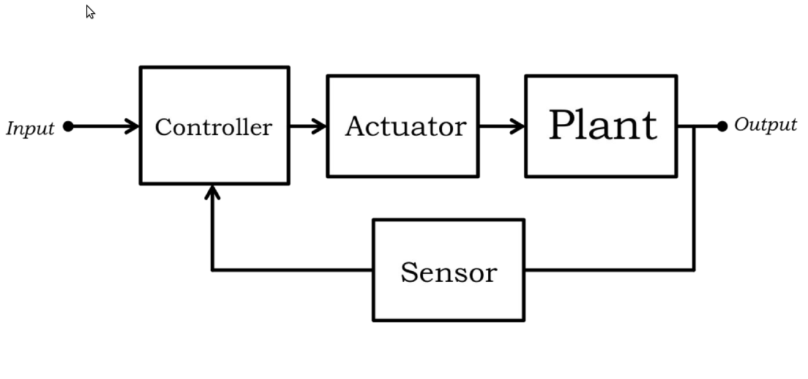
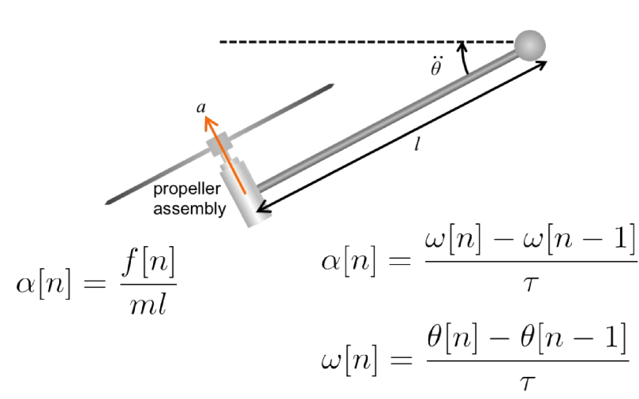
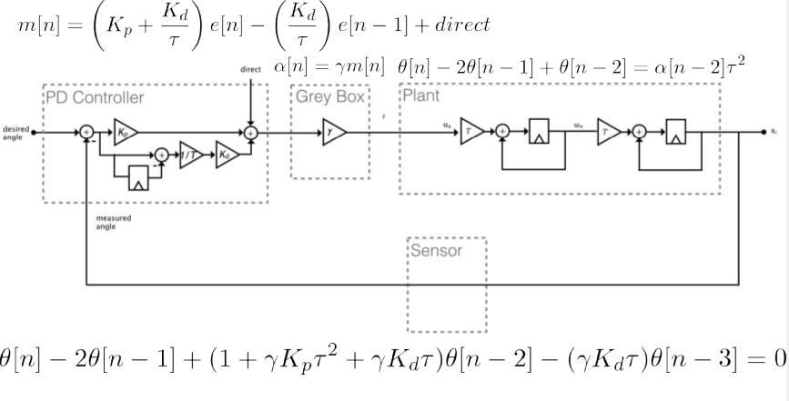

# copter_arm_robot

&nbsp;&nbsp;&nbsp;&nbsp;  

Project designed to learn PID control, relying on ros_control + gazebo for sim/real scenarios

&nbsp;&nbsp;&nbsp;&nbsp; 

Definition of the third degree polynomial

&nbsp;&nbsp;&nbsp;&nbsp;   